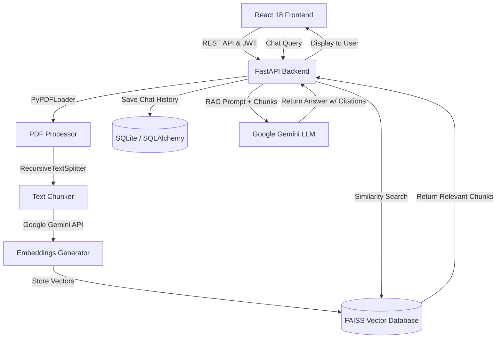

# LegalLens: System Design & Architecture
*(Internal Document - Kept Local)*

## 1. High-Level Architecture
LegalLens is built using a monolithic but modular full-stack architecture separated into a fast asynchronous backend (FastAPI) and a reactive frontend (React). 

## 2. Backend Design (FastAPI)
The backend is responsible for document ingestion, vector storage, and RAG coordination.

* **API Layer**: Exposes endpoints for `/auth`, `/contracts` (uploading/parsing), and `/chat` (RAG queries).
* **Document Pipeline**: 
  1. PDF is uploaded and saved to `uploads/`.
  2. PyPDF2 reads the text.
  3. LangChain's `RecursiveCharacterTextSplitter` chunks the text (e.g., 1000 characters, 200 overlap) to preserve clause context.
* **Vector Store**: FAISS (Facebook AI Similarity Search) is used locally to store the generated embeddings for fast semantic retrieval.
* **LLM Integration**: Google Gemini 2.5 Flash is used via LangChain to act as the reasoning engine for risk extraction and conversational chat.

## 3. Database Schema (SQLite)
* **Users Table**: Manages authentication (id, email, password_hash).
* **Contracts Table**: Stores metadata about uploaded contracts (id, user_id, filename, status, upload_date).
* **Risks Table**: Stores automated extractions (id, contract_id, risk_type, clause_text, severity).
* **Chats Table**: Stores message history for the conversational interface (id, contract_id, user_message, ai_response, citations).

## 4. Frontend Design (React + Vite)
The frontend uses a modern, legal-tech aesthetic (deep slate, gold accents, crisp typography).

* **State Management**: React Context or local state for the active contract session.
* **Workspace View**: A split-pane layout:
  * **Left Pane**: PDF Viewer component displaying the raw contract.
  * **Right Pane**: Tabbed interface switching between "Automated Risks" (the extracted redlines) and "Chat" (the interactive RAG assistant).
* **Routing**: React Router for navigation between the Dashboard (list of contracts) and the Workspace.

## 5. Deployment & MVP Constraints
* This system is designed to run locally for development and portfolio demonstration.
* FAISS is used in-memory/on-disk rather than a distributed cloud vector DB (like Pinecone) to ensure the project can be cloned and run instantly without massive cloud setup overhead.
